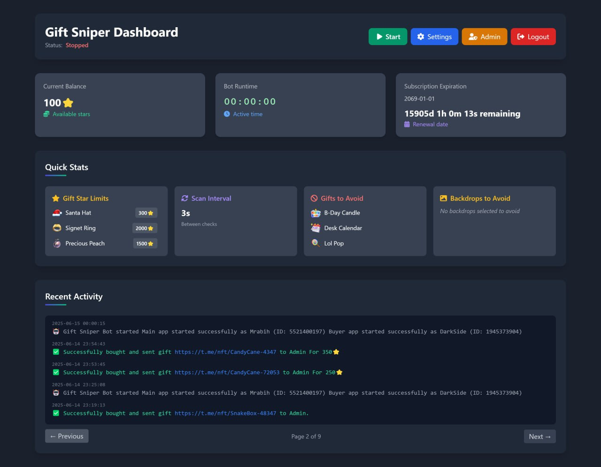

# 🎁 GiftSniper Pro - Automated Telegram Gift Marketplace Bot



## 📖 Overview
GiftSniper Pro is a sophisticated web-based bot that automatically monitors and purchases gifts from the Telegram marketplace. It scans for gifts below your configured price limits, filters unwanted gifts and backdrops, and automatically sends purchased gifts to your specified Telegram account.

## ✨ Key Features
- Web Dashboard: Beautiful, responsive interface with real-time monitoring
- Automated Gift Hunting: Continuously scans the Telegram marketplace for bargain gifts
- Customizable Limits: Set individual price limits for each gift type
- Smart Filtering: Exclude specific gifts and backdrops you don't want
- Dual Account System: Uses separate "app" and "buyer" Telegram accounts
- Admin Panel: Multi-user management with subscription tracking
- Real-time Logs: Live activity monitoring with pagination
- Proxy Support: Optional proxy rotation for improved reliability
- Push Notifications: Web push notifications for important events
- Session Persistence: Survives server restarts and maintains state

## 🏗️ Architecture
The system consists of:
- Flask Web Server: Handles user interface and API endpoints
- Pyrogram Integration: Manages Telegram client sessions
- Multi-threaded Bot Engine: Runs gift scanning in background threads
- User Management: Per-user settings, sessions, and bot states
- Proxy Manager: Rotates proxies to prevent rate limiting

## 📋 Prerequisites
System Requirements:
- Python: Version 3.10, 3.11, or 3.12 specifically (3.12 recommended)
- Python Development Headers: python3.12-dev or equivalent for your version
- RAM: Minimum 2GB, 4GB recommended
- Storage: 500MB free space
- Network: Stable internet connection with Telegram access

## 🔧 Installation

### 1️⃣ Clone the repository
```bash
git clone https://github.com/notashur/Telegram-GiftSniper-Web.git
cd Telegram-GiftSniper-Web
```
### 2️⃣ Create a virtual environment
```bash
python3.12 -m venv venv
```
### 3️⃣ Activate the virtual environment
# Linux / macOS
```bash
source venv/bin/activate
```
# Windows
```bash
venv\Scripts\activate
```
### 4️⃣ Install dependencies
```bash
pip install -r requirements.txt
```
## ▶️ Running the Project
```bash
./run.sh
```

## 🔐 Default Admin Login

After starting the server, you can access the web panel using the default admin credentials:

Username: ashur  
Password: admin123  

## 🔄 Changing Admin Credentials

For security reasons, you should change the default credentials immediately.

Admin users are stored in:

data/users.json

You can edit:
- Username
- Password
- Admin flags / permissions

Then restart the server for changes to take effect.

⚠️ Never expose the default credentials on a public server.

## 🖼️ Gift Images & Auto Update
- Gift images are downloaded only once
- Cached in static/gifts/
- Automatically refreshed only when gift data changes
- Prevents unnecessary downloads and keeps startup fast

## ⚠️ Disclaimer
This project is provided for educational and research purposes only.
The author is not responsible for misuse.

## 📜 License
[MIT License](LICENSE)
